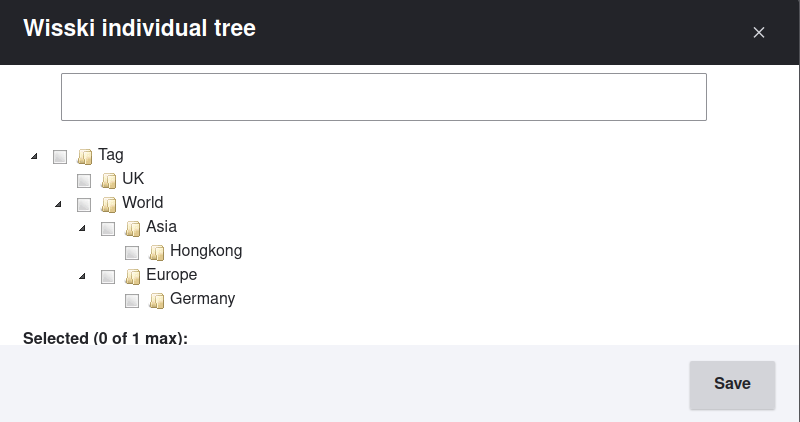

# WissKI entity reference tree 🌳️


A Drupal module extending [drupal/entity_reference_tree](https://www.drupal.org/project/entity_reference_tree) to provide a hierarchy of entities configured through disambiguation points in the pathbuilder, e.g., tags or other forms of taxonomy.
This module depends on `drupal/entity_reference_tree` and was tested successfully with `2.1.0`.

**Note:** This module depends on the dynamic dispatch to other tree-builders defined in `src/web/modules/contrib/entity_reference_tree/src/Controller/EntityReferenceTreeController.php:104`.
Should this dispatch ever go away, this module **will break** (or at least cease to function, which is the same).

Required dynamic dispatch in `drupal/entity_reference_tree`:
```php
// Instance a entity tree builder for this entity type if it exists.
if (\Drupal::hasService('entity_reference_' . $entity_type . '_tree_builder')) {
  $treeBuilder = \Drupal::service('entity_reference_' . $entity_type . '_tree_builder');
}
```



## Requirements

* PHP `^8.2`
* `drupal/wisski` (tested on `3.15`)[^1]
* `drupal/entity_reference_tree` (tested on `2.3.2`)[^1]

[^1]: Older versions might work fine.

## Installation

```shell
$ composer require dmwg/wisski_entity_reference_tree
```

## Usage

1. Enable this module, along with `drupal/entity_reference_tree` via `/admin/modules`
2. Under `/admin/structure/`, configure the required bundle:
   1. Go to `Manage form display`
   2. For the required field, set the type to "Entity reference tree"
   3. (optional) Configure the theme of the widget and other layout properties

## Contributing

We welcome all and any contributions via Pull Requests to this repository!

### Local development environment

For local development, it is **highly recommended** to install this module into an existing Drupal codebase, e.g., under `web/modules/custom`.
Furthermore, we recommend at least a basic WissKI installation (c.f. [`drupal/wisski`](https://www.drupal.org/project/wisski)).
This will provide a richer code-completion for base-Drupal, as well as WissKI-specific code.

**Important:** without a local Drupal installation, static analysis via `phpstan` will fail miserably, as it relies on a Drupal autoloader.

The following example assumes an installation, and clones into `web/modules/custom`:
```shell
$ cd <DRUPAL_ROOT>/web/modules/custom
$ git clone https://github.com/dmwg/wisski_entity_reference_tree
$ cd wisski_entity_reference
$ composer install
```

### Linting & Static analysis

Please run `vendor/bin/phpcs --standard=Drupal` and fix any flagged errors; `vendor/bin/phpcbf --standard=Drupal src` can assist.

Please run `vendor/bin/phpstan` and fix any errors; don't let a failing build discourage you, we'll try and figure it out in the PR.

## Authors and acknowledgment

* `Oliver Baumann <oliver.baumann@uni-bayreuth.de>`
  * Refactoring & Maintenance
* `Myriel Fichtner`
  * Concept & original version
* `Philipp Eisenhut`
  * Concept & original version

## Project status

Alive, but dormant.
